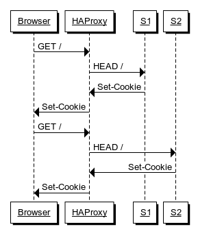
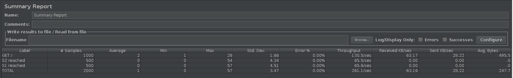
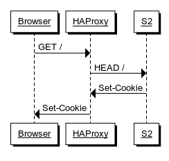
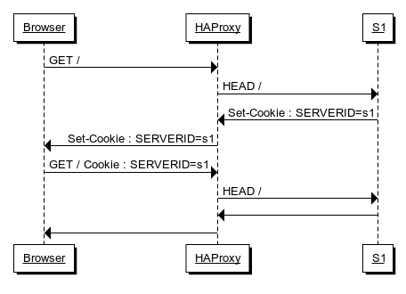
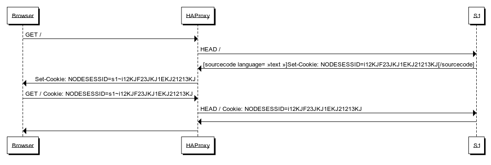

# Lab 03 - Load Balancing
Authors: Mercier Jordan, Vogel Maximilian

Date: 13.11.2019

## Task 1: Install the tools

### 1
A chaque refresh de la page, les paramètres qui changent sont: le serveur web vers lequel on est redirigé par le load balancer change à chaque requête de celui en 192.168.42.11 (s1) à 192.168.42.22 (s2) ainsi que la session id. On change donc à chaque requête d'un serveur à l'autre et à chaque fois une nouvelle session est ouverte. Le compteur sessionsViews reste donc toujours à 1, puisque chaque session ne fait qu'une vue.

### 2

Pour l'instant à chaque requête on accède à l'application en tant qu'utilisateur différent: ce n'est pas du tout ce qu'on veut. Etant donné qu'on accède toujours depuis le même client, on aimerait que notre session reste toujours la même en suivant ce mode d'opération.

De manière générale, on voudrait 1 session par client user et que cet id soit le même, peu importe lequel de nos deux serveurs est accédé.

### 3



### 4



### 5



En refaisant le même scénario JMeter on aperçoit que le même nombre de requêtes est fait, mais qu'elles sont toutes redirigées vers s2. On a également pu constater qu'avec un seul serveur, ce test a pris bien plus de temps à se terminer, ce qui nous semble logique.

## Task 2: Sticky sessions

### 1

Les deux méthodes permettant au load-balancer de créer un cookie par session sont gérées dans le fichier de config (comme on le verra dans un instant), c'est simplement la forme de ce cookie qui change.

Pour le cookie géré par HAProxy, la forme de ce dernier est relativement propre : il prend la forme SERVERID=s1, 's1' étant le nom du serveur dans HAProxy.



Pour le cookie géré par l'application, HAProxy doit traduire ce dernier du browser au serveur et inversément. On peut observer ce changement dans le schéma suivant:



En raison de la simplicité de l'affichage, on a choisi d'implémenter le cookie géré par HAProxy.

### 2

Nous avons choisi d'utiliser la méthode avec le NODESESSID. Dans la rubrique backend du fichier `haproxy.cfg` nous avons ajouté la ligne:
```cfg
backend nodes
    ...
    # Define the sticky session policy
    # http://cbonte.github.io/haproxy-dconv/configuration-1.5.html#4-cookie
    cookie SERVERID insert indirect nocache
    ...
```

### 3


### 4


### 5


### 6

## Task 3: Drain mode


## Task 4: Round robin in degraded mode


## Task 5: Balancing strategies

