# Lab 03 - Load Balancing
Authors: Mercier Jordan, Vogel Maximilian

Date: 01.12.2019

## Task 1: Install the tools

### 1.1
A chaque refresh de la page, les paramètres qui changent sont: le serveur web vers lequel on est redirigé par le load balancer change à chaque requête de celui en 192.168.42.11 (s1) à 192.168.42.22 (s2) ainsi que la session id. On change donc à chaque requête d'un serveur à l'autre et à chaque fois une nouvelle session est ouverte. Le compteur sessionsViews reste donc toujours à 1, puisque chaque session ne fait qu'une vue.

### 1.2

Pour l'instant à chaque requête on accède à l'application en tant qu'utilisateur différent: ce n'est pas du tout ce qu'on veut. Etant donné qu'on accède toujours depuis le même client, on aimerait que notre session reste toujours la même en suivant ce mode d'opération.

De manière générale, on voudrait 1 session par client user et que cet id soit le même, peu importe lequel de nos deux serveurs est accédé.

### 1.3


### 1.4


### 1.5


En refaisant le même scénario JMeter on aperçoit que le même nombre de requêtes est fait, mais qu'elles sont toutes redirigées vers s2. On a également pu constater qu'avec un seul serveur, ce test a pris bien plus de temps à se terminer, ce qui nous semble logique.

## Task 2: Sticky sessions

### 2.1

Les deux méthodes permettant au load-balancer de créer un cookie par session sont gérées dans le fichier de config (comme on le verra dans un instant), c'est simplement la forme de ce cookie qui change.

Pour le cookie géré par HAProxy, la forme de ce dernier est relativement propre : il prend la forme SERVERID=s1, 's1' étant le nom du serveur dans HAProxy.


Pour le cookie géré par l'application, HAProxy doit traduire ce dernier du browser au serveur et inversément. On peut observer ce changement dans le schéma suivant:


En raison de la simplicité de l'affichage, on a choisi d'implémenter le cookie géré par HAProxy.

### 2.2

Nous avons choisi d'utiliser la méthode avec le SERVERID. Dans la rubrique backend du fichier `haproxy.cfg` nous avons ajouté la ligne:
```cfg
backend nodes
    # Define the sticky session policy
    # http://cbonte.github.io/haproxy-dconv/configuration-1.5.html#4-cookie
    cookie SERVERID insert indirect nocache

    # Define the list of nodes to be in the balancing mechanism
    # http://cbonte.github.io/haproxy-dconv/configuration-1.5.html#4-server
    server s1 ${WEBAPP_1_IP}:3000 check cookie s1
    server s2 ${WEBAPP_2_IP}:3000 check cookie s2
```

### 2.3

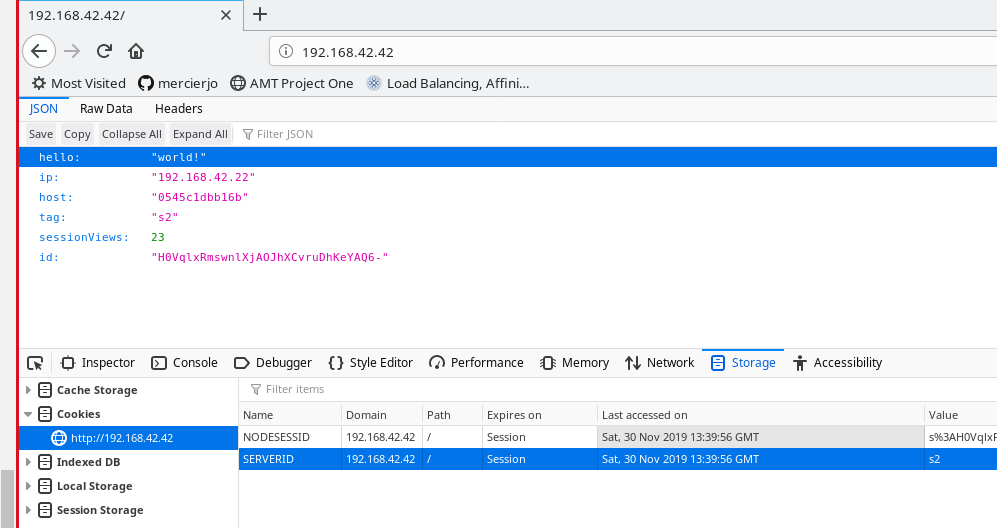  

Comme on peut le constater, à chaque rafraîchissement on garde la même session sur le même serveur. C'est le comportement désiré. On observe également que l'on reçoit bien notre cookie `SERVERID` qui à pour valeur `s2`.

### 2.4

Il se passe exactement ce que nous avons prédit au point 2.1: Après une première requête faite par le navigateur, le navigateur se voit attribué un cookie avec le `SERVERID` de `s2` dans ce cas, puis à chaque nouvelle ce cookie est utilisé pour accéder à `s2`.  


Le test avec les deux navigateurs différents nous montre que la deuxième fenêtre se comporte comme un nouvel utilisateur et accède à l'autre serveur.

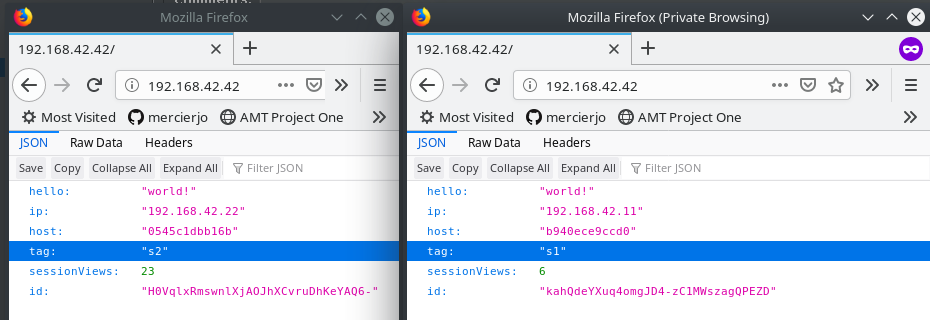

### 2.5

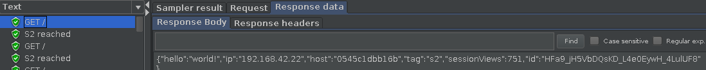

Comme on peut le constater sur cette screenshot, notre thread (utilisateur) accède constamment au même serveur pour nos requêtes avec le même cookie SERVERID, ce qui est juste et différent de ce qu'on a vu au point 1.

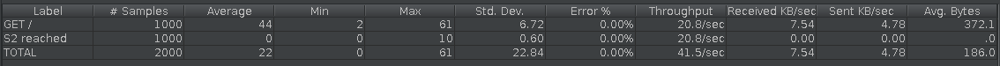

### 2.6

Après avoir changé le nombre de threads dans notre ThreadGroup (et donc d'être passé de 1 à 2 'utilisateurs'), on peut observer avec la screenshot suivante que ces derniers accèdent effectivement à leur serveur respectif, défini dans leur cookie SERVERID.

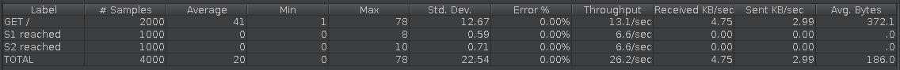

## Task 3: Drain mode

### 3.1

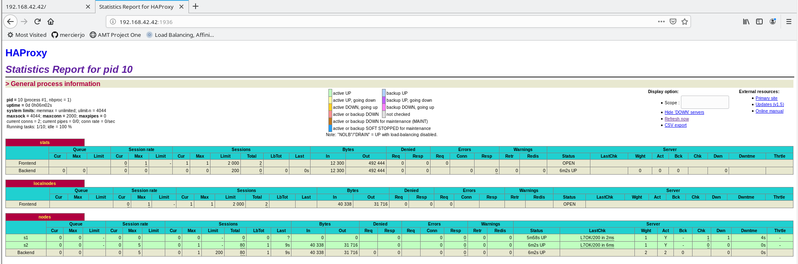 

Le noeud `s2` répond à nos requêtes sur le navigateur.

### 3.2

Commande:
```
set server nodes/s2 state drain
```

Screenshot:

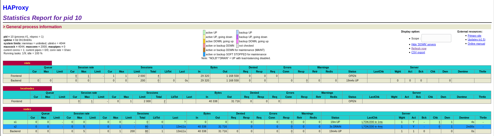 

### 3.3

Nous restons sur le même noeud, parce que nous avons initié la session avant que le noeud `s2` passe en mode DRAIN. Par conséquent lors du prochaine établissement avec le noeud `s2`, nous devrions avoir `s1` qui prend la relève.

### 3.4

Nous avons établit une session avec le noeud `s1`. Cela s'est produit car nous avons une politique round robin sur le proxy.

### 3.5

On établit des nouvelles sessions qu'avec le noeud `s1`.

### 3.6

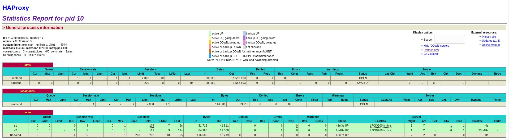  

Nous revenons à une configuration standard où le proxy applique une politique round robin pour dispatcher les requêtes.

### 3.7

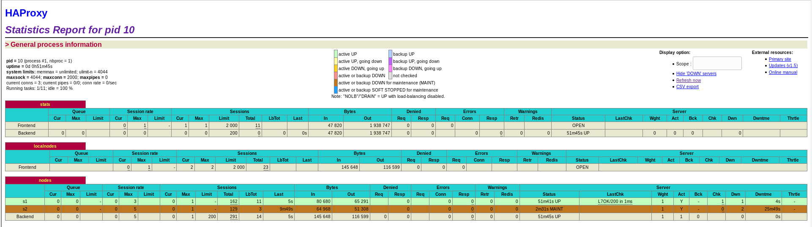  

Toutes les requêtes sont redirigées sur le noeud `s1`.

## Task 4: Round robin in degraded mode

### 4.1

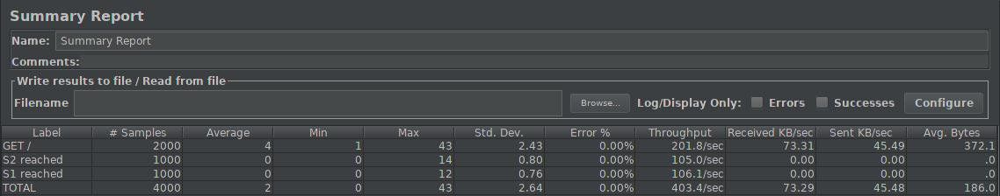

Comme on pouvait s'y attendre, on constate que les deux serveurs ont la même charge

### 4.2

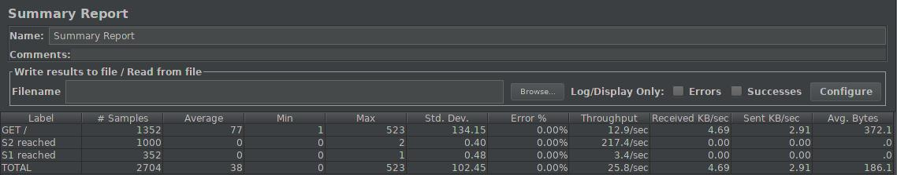

Avec 250ms de délai, la charge est encore également séparée, mais les requêtes envoyées vers s1 prennent enormément de temps, comme on peut le constater avec ce rapport encore en cours. Le throughput de s2 est rapide, alors que le throughput de s1 est très bas.

### 4.3

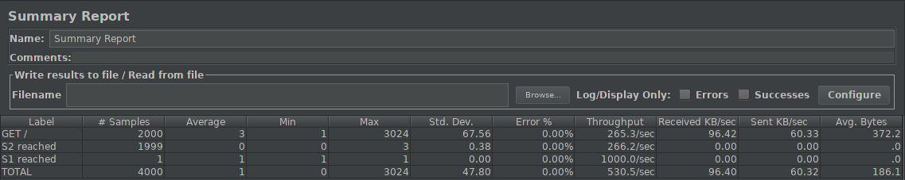

Avec 2500ms de délai, le proxy reconnaît que s1 n'est pas en état de procéder les requêtes et envoie donc toutes les requêtes, sauf la première vers s1, à s2, le comportement disfonctionnel de s1 est donc reconnu et s2 s'occupe des requêtes.

### 4.4

Nous n'avons pas observé d'erreurs dans nos rapports JMeter étant donné que le problème ne se trouve pas au niveau des requêtes elles-mêmes, mais qu'on simule un comportement lent/disfonctionnel de la part de s1 : HAProxy fait simplement le boulot de load-balancer et, en fonction des paramètres que nous avons mis en place, décide s'il doit envoyer les requêtes vers un serveur plus rapide ou pas.

### 4.5

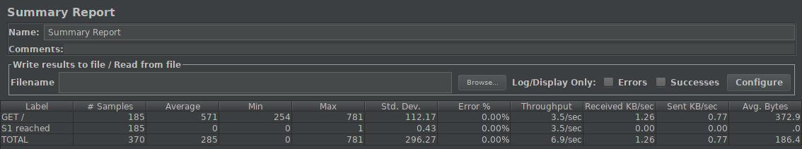

### 4.6

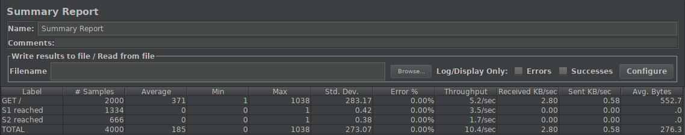

Première observation : les poids de serveurs sont respéctés. En effet, avec un poids de 2 pour s1 et un poids de 1 pour s2 et donc un poids total de 3, 2/3 des requêtes ont été acheminées vers s1 et le 1/3 restant vers s2. On peut également constater en regardant la suite de GET suivantes :

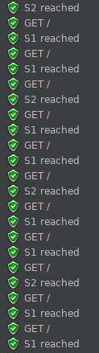

la suite de requêtes est exactement donnée par les poids de serveurs, ce qui veut dire qu'avant de pouvoir envoyer ses requêtes à s2, HAProxy doit d'abord avoir la réponse de s1, ce qui explique le fait que le throughput de s2 soit la moïtié de celui d's1 alors qu'il ne présente pas de délai.

## Task 5: Balancing strategies